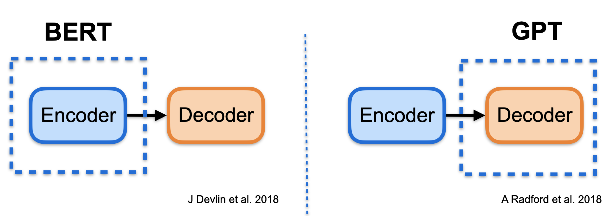
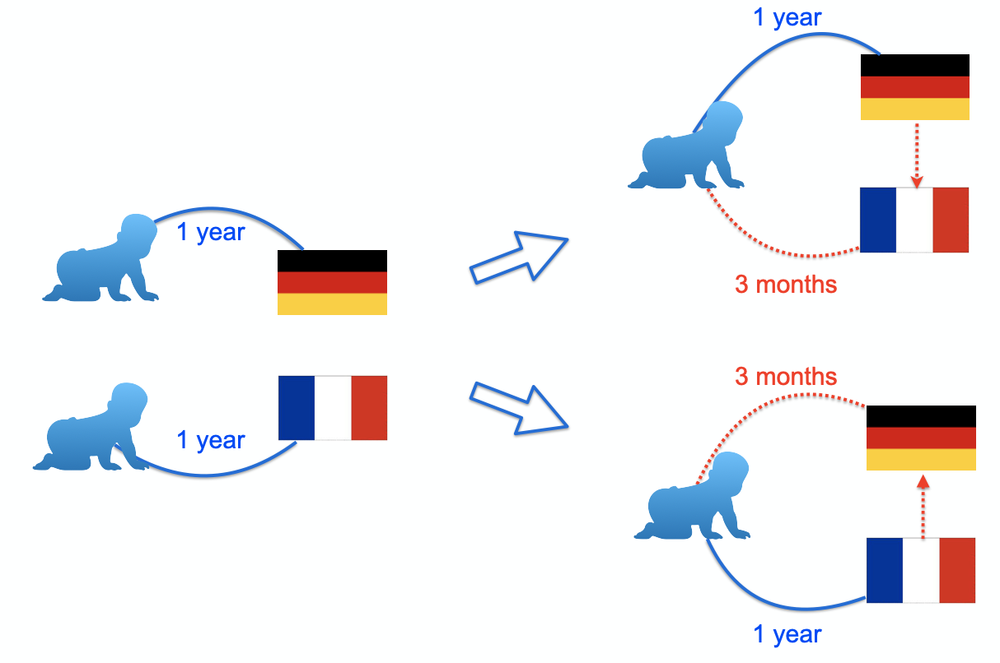
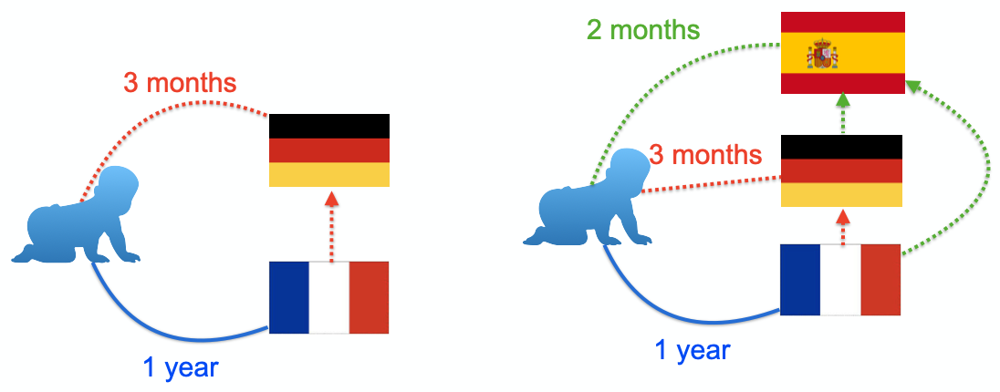
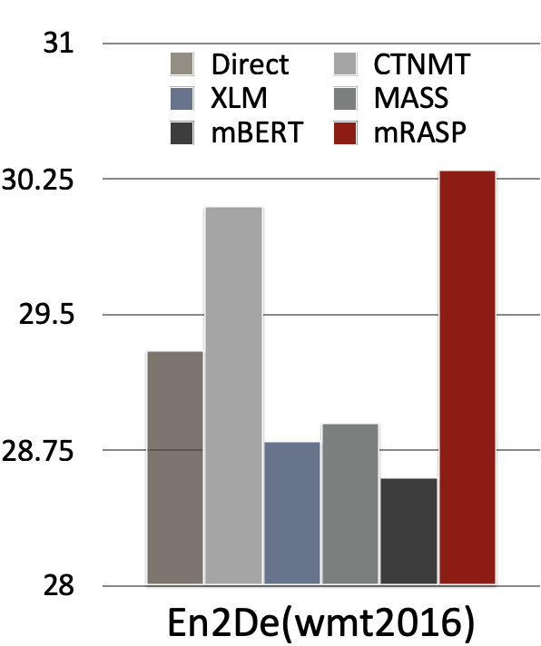
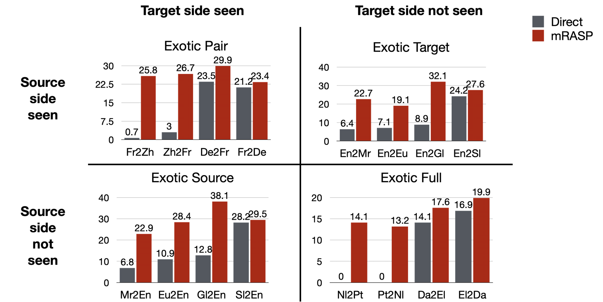
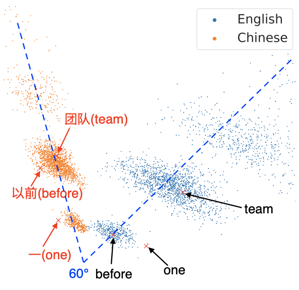
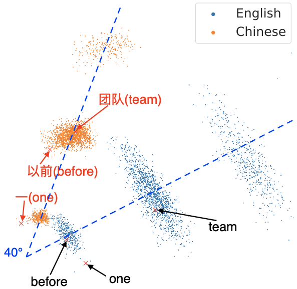
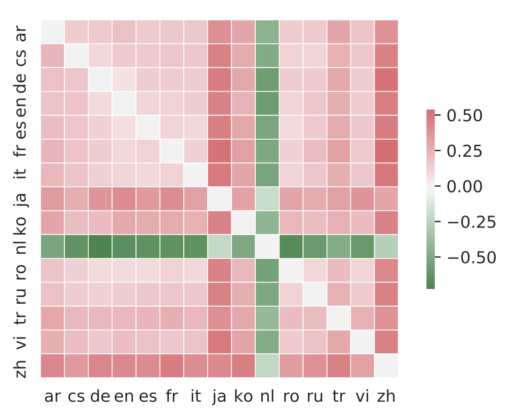
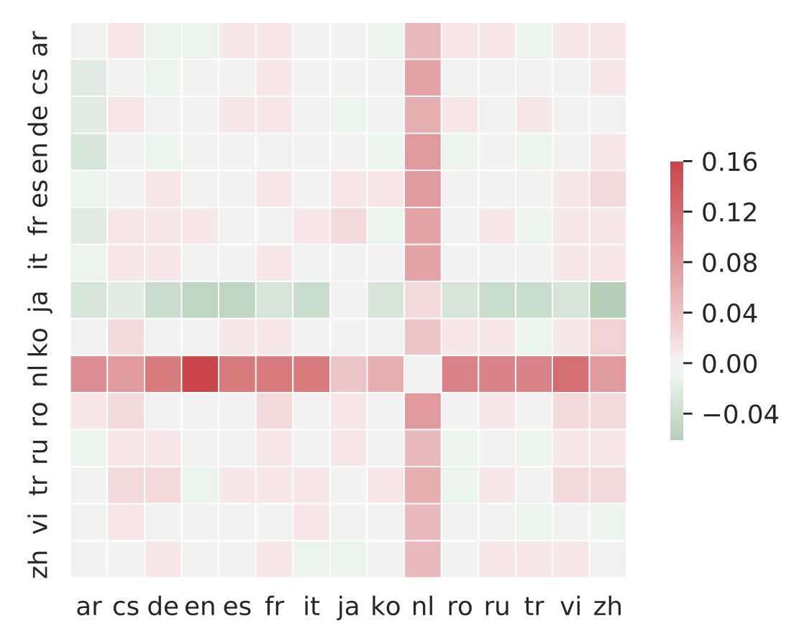
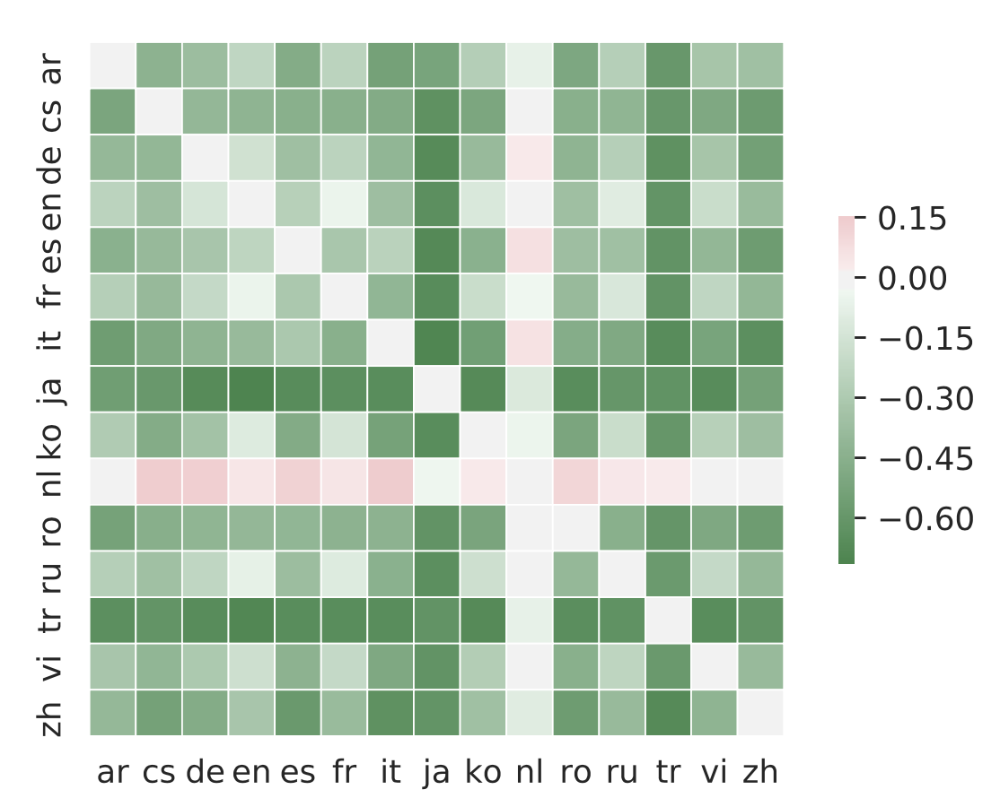

​	In 1920, the great philosopher Bertrand Russell visited China, accompanied by Yuen Ren Chao, a Chinese-American linguist. Mr. Chao was a naturally gifted polyglot. At that time, he could already speak Baoding dialect, Wu dialect, Fuzhou dialect, Nanjing dialect, and English. He accompanied Russell from Shanghai to Changsha by ship. During the trip, he was learning Changsha dialect from Yang Ruiliu, an economist on the same ship. When the ship docked in Changsha, Yuen Ren Chao was already able to translate Russell's speeches and slang into Changsha dialect. Can our neural network  become a model like "Yuen Ren Chao" on machine translation? That is, to create a unified model with multilingual abilities, and when encountering new languages, the model could quickly adapt to translating new ones after training with a small amount of data.

Reading Time: About 15 minutes.

Paper：https://arxiv.org/abs/2010.03142

Github: https://github.com/linzehui/mRASP

Volctrans Experience Official Website: http://translate.volcengine.cn/
<!-- more -->

## Introduction


A recent work mRASP, which appeared at the 2020 Conference of Empirical Methods in Natural Language Processing, aims to provide a Yuen Ren Chao polyglot model for machine translation [1]. The key idea is to pre-train a model with multilingual capability, and yield any specific translation model by fine-tuning on the corresponding parallel corpus. The model trained with mRASP technique in 32 languages has achieved a comprehensive and significant improvement in 47 translation test sets.

Unlike previous translation models, mRASP has established a successful paradigm of pre-training and fine-tuning for machine translation. This is similar to BERT's role on NLU tasks. There were already pretrained models for natural language generation (GPT). However, they are limited in extending their capabilities on multilingual machine translation tasks.  The central problem that mRASP wants to solve is, can we develop a unified pre-trained translation model and extend it by fine-tuning on a small amount of parallel corpus on any specific language pair to obtain any-language translation model?

mRASP is designed for machine translation tasks. It has three advantages. First, the translation quality can be consistently improved regardless of the amount of parallel bilingual corpus. In rich-resource directions, such as the standard English-French wmt2014 translation task, which already has 40 million parallel sentence pairs for training, mRASP can still significantly improve the quality, reaching a BLEU score of 44.3. In low-resource directions, mRASP performs surprisingly well. In extreme cases, when we have only 10,000 training data for fine-tuning, a reasonable translation model can be obtained through 10-minute fine-tuning. Second, It breaks the limit on languages, for any direction, the mRASP can be directly used to fine-tune to get a single-directional translation model. Finally, it is resource-efficient. Some other pre-training paradigms are trained on hundreds of GPUs for a couple of weeks. By contrast, mRASP only needs 8 GPUs for a week. In short, mRASP can be understood as a lightweight BERT in the field of machine translation. When you need a machine translation model, you should try it, it may surprise you! The authors also said that this technology has been used on the Volctrans system developed by ByteDance and has been tested in actual business practice. The authors have kindly published the research data, codes and pre-trained models.

Next, we will introduce and analyze mRASP from three aspects: 1) the challenges of machine translation pre-training; 2) the motivation and methods of mRASP; 3) the performance and analysis of mRASP.

## Challenges in machine translation pre-training
At present, the vast majority of AI tasks are basically statistical learning based on data, and the performance of the model depends on the quality and quantity of data to a large extent. It has become a new successful paradigm for NLP to use a large amount of cheap data to pre-train the model, then fine-tune with a small amount of annotation data in specific scenarios. For example, pre-trained on large-scale unlabeled text, BERT[2] can achieve good results on 11 NLU tasks after fine-tuning on limited annotation data. However, in multilingual machine translation, the paradigm of pre-training and fine-tuning has not yet achieved general success. The training objectives  of previous NLP pre-training methods such as BERT and GPT[5] have a large gap with machine translation, thus are not easy to use directly. mRASP proposed a new idea: it uses massive bilingual parallel corpus accumulated in multiple languages to jointly train a unified model, and then fine-tune based on it. Therefore the pre-training and fine-tuning objectives are as close as possible, so as to give greater play to the role of the pre-training model.




The above figure compares and analyzes the limitations of the previous NLP pre-training paradigms in machine translation scenarios. BERT and GPT respectively correspond to the pre-training of the Transformer[6] encoder part and the decoder part, while machine translation uses the whole sequence-to-sequence model. Only part of the parameters of the translation model are initialized due the inconsistency in model structure. Therefore it will be difficult to effectively play the role of pre-training. As a result, it requires a lot of special skills to be improved [10].

Researchers soon proposed frameworks such as MASS [7] and BART [8] to extend pre-training to sequence-to-sequence tasks. They use auto-encoder for self-learning and have achieved significant results in many downstream NLG tasks. However, there are still two important problems when applying them in machine translation: 1) They brings no improvement in rich-resource languages (such as English, German, English and French). 2) There is no way to extend to multilingual translation tasks. This limitation is largely due to the fact that autocoding is a relatively simple task so it is difficult to learn a deeper representation. By contrast, machine translation requires a more complex semantic transformation. The training objective discrepancy between pre-training and fine-tuning makes it difficult for the model to make the best use of training data. It has become an important challenge to overcome the two problems for the application of pre-training paradigms in the field of machine translation.

## Motivation and Techniques of mRASP
​For language learners, a very interesting phenomenon is that after learning three or four languages, the speed of learning a new language will accelerate. For example, if an English native speaker learns German and French separately, he/she may take one year each. However, if he learns German first and then learns French, he/she may only take one year and three months to learn it. If he/she learns Spanish subsequently, the speed may be faster [3]. The same is true for learning programming languages. Learning C ++ may take one year. Learning Java, Python subsequently may only take one month. A simple explanation is that in the process of multilingual learning, human beings will spontaneously summarize the abstract commonalities among languages and focus on learning the characteristics of new languages. Therefore, in order to improve personal language learning ability, it is often necessary to learn more languages, to have a more accurate grasp of language commonalities, instead of desperately learning one language. By the same token, for machine translation, it has become a very interesting question whether the translation ability can be transferred to different languages so that the information between different languages can be utilized for each other.






The design goal of mRASP is based on such considerations: design a general pre-trained model to learn the commonalities of transformation between languages, and then it will be easier to migrate to the new translation direction. Just like language learners, after learning two languages, the third language becomes easier. The design of mRASP follows two basic principles: first, the training objective of pre-training is the same as machine translation, and it is necessary to learn the transformation ability between languages; second, learn the universal representation of the language as much as possible, if the semantics of cross-lingual sentences or words are close, the representation should also be close.

mRASP follows a common pre-training-fine-tuning framework. In the pre-training stage, unlike the traditional pre-training model in which massive unsupervised monolingual data are used, mRASP takes a different approach: it puts multilingual parallel data into the same model for joint training. The Transformer architecture is adopted, plus a language identifier (Language token) to identify the source language and the target language. In order to ensure that sentences and words in different languages could be embedded in the neighbor space, sentences with the same meaning,  random alignment substitution (RAS) is introduced to create a richer context.

There is a certain probability that "爱"(Chinese) in a Chinese sentence "我 爱 北京 天安门" will be replaced by "aime" (French), and "北京"(Chinese) will also be replaced by "Pékin" (French), so the original sentence becomes "I aime Pékin Tiananmen." A pair of parallel sentence pairs in the training set can be expanded into two pairs (even three pairs, four pairs,......)

```
我 爱 北京 天安门 ==> I love Beijing Tiananmen Square
我 aime Pékin 天安门 ==> I love Beijing Tiananmen Square
```

For the model, by learning from abundant parallel corpus, it will naturally learn the correspondence between synonyms across different languages according to this "artificially created context". In fact, RAS based on parallel dictionaries has bridge the representation gap of synonyms across different languages. In the above example, the word vector expectations calculated by "爱"('love' in Chinese) and "aime"('love' in French) are as close as possible.


In the fine-tuning stage, we initialize the parameters with mRASP, and then we adopt the same training method as the traditional single-directional machine translation. Therefore, using mRASP does not require any additional skills. For a detailed introduction, please refer to the paper[1].

## Effectiveness of mRASP
mRASP uses parallel corpus of 32 languages to-and-from English for pre-training. When we only use parallel corpus of English to French wmt14 for fine-tuning, it achieves 44.3 BLEU without laborious Back Translation of massive monolingual corpus. Moreover, when applied to a new translation direction Dutch (Nl) to Portuguese (Pt), with only 12,000 parallel sentence pairs for fine-tuning, mRASP gets a reasonable (BLEU 10 +) model in ten minutes. By contrast, training any usable MT model from scratch using the equivalent parallel sentence pairs is impossible (BLEU is close to 0).

In summary, mRASP has the following advantages:
1. Easy to reproduce

The pre-training of mRASP only requires a total of 110 million parallel sentence pairs (the same pair of parallel sentence is applicable to both directions, resulting in a total of 220 million training samples), and the vocabulary only has 64k bpe subword tokens. Compared with other pre-training methods, in which tens of billions of data and dozens of layers are frequently used, the training process is less difficult. We can complete the pre-training process on 32 languages in less than a week using 8 GPUs. By the way, support for more languages can also be simply expanded.

2. Highly Versatile

Compared with the single-directional machine translation models, mRASP brings a consistent improvement in rich, medium and low-resource scenarios. Even for English to French direction where we have the largest parallel corpus, the translation quality is further improved by 1.1 BLEU. More surprisingly, for Dutch to Portuguese direction that have never been seen in the pre-training data, a significant improvement of 10 + BLEU has also been achieved.

Here are some representative experimental results:

### 1. En-De and En-Fr Benchmarks
The following figure compares the effect of mRASP on En-De and En-Fr with several concurrent cross-lingual pre-training models. It can be seen that mRASP has certain advantages: it reaches 30.3 (tokenized BLEU) on En->De wmt 2016 test set, 44.3 (tokenized BLEU) on En->Fr wmt 2014 test set. CTNMT uses BERT pre-training. MASS introduces large-scale monolingual data. mBERT is a multilingual BERT model. mBART is another pre-training method that is proposed concurrently, it uses massive multilingual monolingual data, and is trained on 256 GPUs for 20 days.




### 2. Extend to language not seen during the pre-training phase
Directions that are not included in parallel pairs during the pre-training stage, are also referred as "Exotic Directions". Whether mRASP is effective on Exotic Directions, determines whether mRASP has good generalization capabilities.

The Exotic Directions are divided into four situations in the paper:

- Exotic Pair: Both the source language and the target language have been individually pre-trained, but the model has not yet seen the bilingual pairs of them
- Exotic Source: The model has only seen the target language in the pre-training stage, and the source language has not been seen at all
- Exotic Target: The model has only seen the source language in the pre-training stage, and the target language has not been seen at all
- Exotic Full: The model has not seen the source language or the target language at all in the pre-training stage

It is difficult to train machine translation under the circumstances. Of course, the most difficult one is the last one, which is equivalent to requiring people who have never learned Latin and Hindi to read a few sentences in Latin and Hindi then translate between them.


|  Category  | Source language seen during pre-training? | Target language seen during pre-training? | Language pair seen during pre-training? | 
| :----------:| :---: | :----: | :----:|
|  Exotic Pair  | ✔ | ✔ |  X |
|  Exotic Source  |  X | ✔ | X |
| Exotic Target  | ✔ | X | X |
|  Exotic Full  | X | X |  X|

It is worth noting that both sides of Fr-Zh have appeared separately, but they have not appeared as parallel pairs. mRASP achieves a 20 + BLEU score after fine-tuning on 20K parallel corpus.

For Exotic Full scenario, such as Dutch to Portuguese (Nl-Pt), only 12,000 parallel corpora are used, and after about 10 minutes of training, you can achieve a 10+ BLEU score.




### 3. Case study
In order to understand the effect of mRASP more intuitively, the authors also make a case study in the paper.

#### French-Chinese(Fr-Zh)

- Exotic Pair, 20k Parallel Sentence Pair
- Direct (0.7 BLEU) is much weaker than mRASP (25.8 BLEU)

The Direct system does not work at all, while the mRASP system translates well.

| | Original Text | Translation in English |
| :---: | :--- | :--- |
|  source | Ordre du jour provisoire de la 7424e séance ( privée ) du Conseil | Provisional agenda for the 7424th (closed) meeting of the Council |
| target | 安全 理事会 第 7424 次 ( 闭门 ) 会议 临时 议程 | Security Council, 7424th (closed) meeting, provisional, agenda |
| Direct | 事实上 ， 国际 货币 基金 组织 的 国际 货币 基金 组织 （ IMF ） | In fact, international, monetary, fund, organization, international, monetary, fund, organization (IMF) |
| mRASP | 安理会 第 7424 次 （ 非 公开 ） 会议 临时 议程 | Council, 7424th (closed) meeting, provisional, agenda |

#### Dutch-Portuguese (Nl-Pt)
- Exotic Full, 12,000 parallel sentence pairs
- Direct 0 BLEU vs mRASP 14.1 BLEU

We find that the translation system obtained by mRASP can not successfully translate every detail, but it can grasp the key information of the original text. For example, in the following example (1) date (2) minutes of the meeting <-> news of meeting (3) circulated <-> shared.

| | Original Text | Translation in English |
| :---: | :--- | :--- |
| source | de notulen van de vergadering van donderdag 21 september zijn rondgedeeld. | The minutes of the meeting on Thursday, 21 September have been circulated. |
| target | a acta da sessão de quinta feira , 21 de setembro de 2000 , já foi distribuída. | The minutes of the meeting on Thursday, 21 September 2000 have now been distributed. |
| Direct | Os governos, os líderes mundiais dos seus próprios. | Governments, their own world leaders. |
| mRASP | As notícias da reunião do dia 21 de Setembro foram partilhadas. | News of the September 21 meeting has been shared. |

#### English-French (En-Fr)

- We found that one of the advantages of the model trained by the mRASP method over the Direct method is that the Direct system tends to ignore meaningless words (such as articles, deixis, etc.), while the mRASP maintains the consistency of articles and deixis.

| | Text |
| :---: | :--- |
| source | An investigation is under way to find the cause of the fire . |
| target | Une enquête est en cours pour trouver la cause de cet incendie . |
| Direct | enquête est en cours pour déterminer la cause de l' incendie . |
| mRASP | Une enquête est en cours pour trouver la cause de l' incendie . |

| | Text |
| :---: | :--- |
| source | After Broadway and London , Paris is finally finding its voice . |
| target | Après Broadway et Londres , Paris trouve enfin sa voix . |
| Direct | Broadway et Londres , Paris trouve enfin sa voix . |
| mRASP | Après Broadway et Londres , Paris trouve enfin sa voix . |

#### English-Chinese (En-Zh)
| | Original Text | Translation in English |
| :---: | :--- | :--- |
| source | and for the middle class. | |
| target | 对中产阶级而言。 | For the middle class. |
| Direct | 还有中产阶级。  | And the middle class. |
| mRASP | 对中产阶级而言。  | For the middle class. |

### Findings from mRASP trained model

As a general pre-training model, where does the improvements of mRASP for downstream MT tasks come from?

The author believes that its improvements mainly comes from two aspects:
 
  1. mRASP narrows the gap between the vector representation of synonyms across different languages
  2. mRASP narrows the gap between the vector representation of synonymous sentences across different languages

The narrowing of the gap between word-level and sentence-level representations means that after learning parallel sentence pairs in a large number of languages in the pre-training stage, mRASP implicitly "mastered" the language-independent representation, which can be migrated to any language, so mRASP can generally improve the effect of downstream machine translation tasks.

#### 1. mRASP draws word-level vector representation of different language closer
RAS is introduced by making the same context shared between synonyms across different languages. Since the word vector is determined by the context, RAS further draws the representation of synonyms across different languages closer.

Up: w/o RAS, Down: w/ RAS

It can be seen that with the RAS method, the embedding distribution between different languages is drawn closer (the angle becomes smaller).





#### 2. mRASP draws sentence-level vector representation of different language closer
mRASP narrows the gap between the representation of synonyms, as well as the vector representation of semantics.

We use the encoder output vector as the representation of the sentence (L2 normalized averaged-pooled encoded output). From the TED parallel test set (filtered 15-way parallel test set, a total of 2284), we match the nearest sentence based on similarity score (cosine similarity), then calculate the Top-1 accuracy (sentence retrieval accuracy).

Figure 1: The accuracy of mRASP minus the accuracy of mBART [9]. Note that Dutch (Nl) has never appeared in the mRASP pre-training data, and the accuracy in other directions is much higher than that of mBART.

- The average accuracy of mRASP retrieval reached 76%

Figure 2: Accuracy of mRASP minus the accuracy of mRASP w/o RAS. It can be seen that RAS  has obvious benefits on languages (Nl) that did not appear in the pre-training stage.

Figure 3: After removing the language identifier (Language token) at the beginning of the sentence, the accuracy of Nl can be further improved, at a sacrifice that the accuracy of other languages is greatly reduced.








It can be seen that RAS does further draws closer the semantic vector representation, and synonymous sentences will be closely represented after mRASP.

## Summary
Back to the beginning of the article, Mr. Chao, a language genius, has mastered 33 dialects plus 7 foreign languages in his life. From Baoding in the north China to Fuzhou in the south, from the upper reaches to the lower reaches of the Yangtze River, from Berkeley in the United States to Paris in France, he can speak local languages with a local accent. And the establishment of a unified multilingual and cross-domain translation model is one of the ultimate goals of machine translation research. mRASP, which is in line with the language genius Yuen Ren Chao, has established a successful path from multilingual pre-training to fine-tuning to multiple machine translation models, which will also become a new paradigm of machine translation. ByteDance has applied this technology to the Volctrans system and you can try it in the web page attached at the end of the text. We are looking forward to the continuous emergence of new methods in this direction, making great strides towards the ultimate machine translation goal. In the next few years, the progress of machine translation can help everyone in dozens of countries become "Yuen Ren Chao" and truly communicate without language barriers.

## References
[1] Lin, Zehui, et al. "Pre-training Multilingual Neural Machine Translation by Leveraging Alignment Information." In the Conference on Empirical Methods in Natural Language Processing  (2020).

[2] Devlin, Jacob, et al. "Bert: Pre-training of deep bidirectional transformers for language understanding." NAACL-HLT (1) 2019: 4171-4186.

[3] Thomas, Reed, and Callie Mady. "Teaching for transfer: Insights from theory and practices in primary-level French-second-language classrooms." McGill Journal of Education/Revue des sciences de l'éducation de McGill 49.2 (2014): 399-416.

[4] Johnson, Melvin, et al. "Google’s multilingual neural machine translation system: Enabling zero-shot translation." Transactions of the Association for Computational Linguistics 5 (2017): 339-351.

[5] Radford, Alec, et al. "Improving language understanding by generative pre-training." (2018): 12.

[6] Vaswani, Ashish, et al. "Attention is all you need." Advances in neural information processing systems. 2017.

[7] Song, Kaitao, et al. "MASS: Masked Sequence to Sequence Pre-training for Language Generation." ICML. 2019.

[8] Lewis, Mike, et al. "Bart: Denoising sequence-to-sequence pre-training for natural language generation, translation, and comprehension."  ACL 2020: 7871-7880

[9] Liu, Yinhan, et al. "Multilingual denoising pre-training for neural machine translation." TACL.2020

[10] Yang, et al. "Towards Making the Most of BERT in Neural Machine Translation"  AAAI.2020
